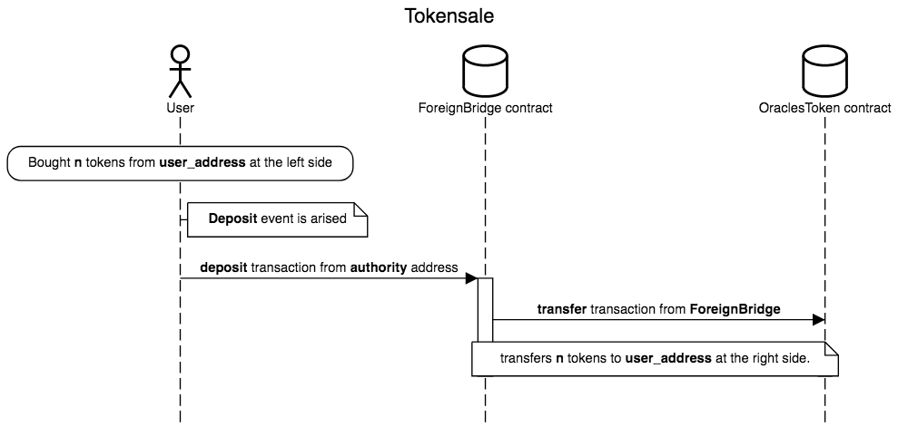

# Tokensale-right

[Right side of the Bridge](bridge-right.sol), [ERC20 compatible Token](https://github.com/oraclesorg/treasury/blob/master/contracts/OraclesToken.sol) and [Treasury](https://github.com/oraclesorg/treasury/blob/master/contracts/Treasury.sol) to exchange tokens to coins

## Before tokensale

- Right-side bridge contract `ForeignBridge` is deployed to the network. Parameters of the constructor: 

| Param |   Type    |                  Description                    |    Value                                |
|-------|-----------|-------------------------------------------------|-----------------------------------------|
| n     | uint256   | Number of authorities to approve deposit tokens | 1                                       |
| a     | address[] | Array of authorities' addresses                 | [addr_will_send_deposit_tx_to_contract] |

- ERC20 compatible token `OraclesToken` contract is deployed to the network. Parameters of the token constructor: 

| Param             |  Type   |            Description             |   Value    |
|-------------------|---------|------------------------------------|------------|
| _bridgeAddress    | address | Right-side bridge contract address |            |
| _totalSupplyItems | uint256 | Token total supply for crowdsale   | 176722560  |
| _decimals         | uint256 | Token decimals                     | 18         |

Token total supply is transfered to the right-side bridge contract address balance at deployment.
- Bridge is configured and started

## Tokensale

## After tokensale

